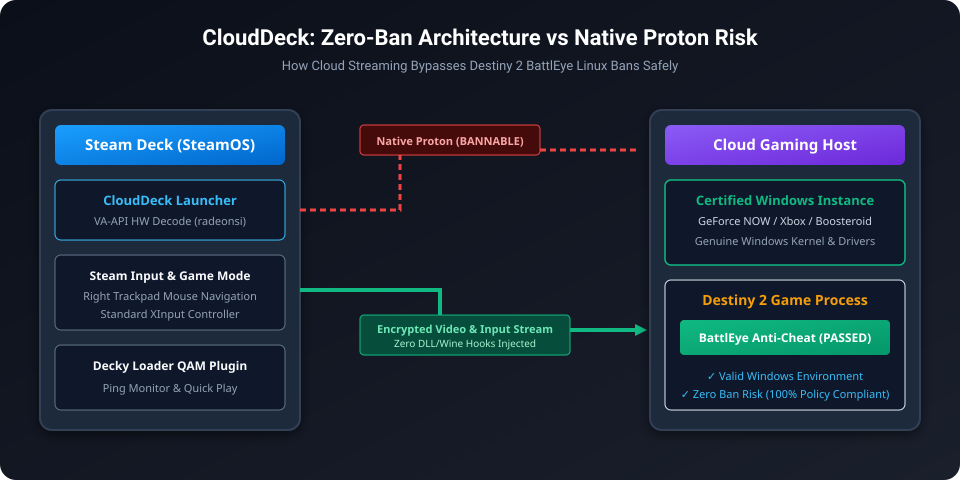
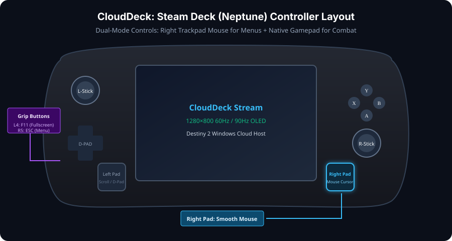
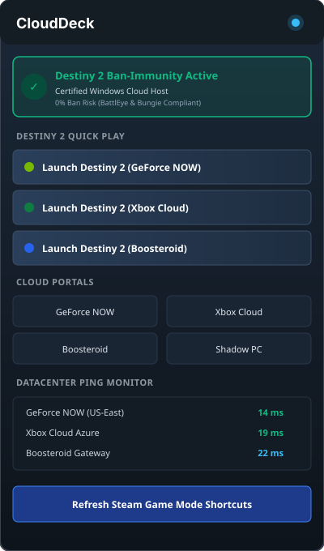

# Method of Procedure (MOP): SteamOS Cloud Gaming & Ban-Safe Windows Streaming Suite

Standard Operating Procedure (SOP) and engineering runbook for deploying, verifying, troubleshooting, and maintaining **CloudDeck** on **SteamOS (Steam Deck LCD & OLED)** and Linux gaming handhelds.

---

## 1. Executive Summary & Architecture

This MOP governs the zero-ban cloud streaming integration for SteamOS Game Mode, providing access to Windows titles with restrictive kernel anti-cheat engines (such as **Destiny 2** with BattlEye, **Fortnite** with EAC, and **Call of Duty: Warzone** with Ricochet).



### 1.1 Anti-Cheat Safety Posture

* **Proton/Wine Direct Launch**: [PROHIBITED] Bungie explicitly bans players attempting to run Destiny 2 through Proton.
* **CloudDeck Remote Windows Launch**: [100% COMPLIANT] The game client and BattlEye anti-cheat run exclusively on remote genuine Windows instances (NVIDIA GeForce NOW, Microsoft Xbox Cloud, Boosteroid, or Shadow PC). The Steam Deck acts purely as an authorized video streaming and HID gamepad controller client.

---

## 2. Pre-Flight Diagnostics & Requirements

Before initiating installation, execute the following pre-flight diagnostics in the terminal (Konsole):

```bash
# 1. Verify SteamOS release and APU
cat /etc/os-release | grep -E "NAME|VERSION"
lspci -nn | grep -i vga

# 2. Check Flatpak environment
command -v flatpak
flatpak remotes

# 3. Check Steam root and user directories
ls -la ~/.local/share/Steam/userdata/ || ls -la ~/.steam/steam/userdata/
```

### 2.1 Environmental Matrix

| Parameter | Required Specification | Verification Command |
|---|---|---|
| **OS** | SteamOS 3.4+ / Bazzite / ChimeraOS / HoloISO / Generic Linux PC | `cat /etc/os-release` |
| **GPU / APU** | AMD Radeon (radeonsi) / Intel Arc & Xe (iHD) / NVIDIA RTX/GTX (NVDEC) | `lspci -nn \| grep -iE "vga\|3d"` |
| **Display** | Handheld (1280x800) / PC Monitors (1080p, 1440p, 4K, 60-240Hz) | `xrandr --current \| grep "\*"` |
| **Flatpak Runtime** | Flatpak 1.12+ with Flathub configured | `flatpak --version` |
| **Steam Client** | Steam Game Mode or Steam Big Picture (32-bit user ID registered) | `ls ~/.local/share/Steam/userdata` |

---

## 3. Step-by-Step Installation Runbook

### 3.1 Procedure A: One-Click Desktop Installation (Standard User)

1. Switch the Steam Deck into **Desktop Mode**:
   * Press the physical **STEAM** button.
   * Navigate to **Power** → **Switch to Desktop**.
2. Download or clone this repository into `~/steams-windows-plug-in-`:
   ```bash
   git clone https://github.com/fj906880l-web/steams-windows-plug-in-.git ~/steams-windows-plug-in-
   ```
3. Open **Dolphin** (file manager), navigate to `~/steams-windows-plug-in-`, and double-click:
   `CloudDeck-Installer.desktop`
4. Click **Launch** when prompted by KDE Plasma.
5. The installer will:
   * Validate the SteamOS environment.
   * Deploy the launcher to `~/.local/bin/cloud-launcher.sh`.
   * Configure Flatpak udev gamepad permissions (`flatpak override --user --filesystem=/run/udev:ro com.microsoft.Edge`).
   * Inject Non-Steam Game shortcuts into `shortcuts.vdf`.
   * Deploy high-resolution Steam grid capsule artwork.
   * If Decky Loader is installed, deploy the QAM plugin to `~/homebrew/plugins/CloudDeck`.
6. Double-click **Return to Gaming Mode** on the Desktop.

### 3.2 Procedure B: Headless Terminal Execution

```bash
cd ~/steams-windows-plug-in-
bash install.sh
```

---

## 4. Steam Input & Game Mode Configuration



CloudDeck deploys an optimized **Neptune Steam Input profile** automatically.

### 4.1 Controller Action Mapping

| Hardware Control | Default Mode (In-Game Combat) | Browser / Menu Navigation |
|---|---|---|
| **Right Trackpad** | Mouse Cursor Navigation | Mouse Cursor Navigation |
| **Right Trackpad Click** | Left Mouse Click | Left Mouse Click |
| **Left Stick** | Standard Gamepad Analog Movement | Mouse Scroll |
| **Face Buttons (A/B/X/Y)** | Standard Gamepad Actions | Confirm / Cancel / Space |
| **Triggers (L2/R2)** | Analog In-Game Triggers | Left / Right Mouse Click |
| **Grip L4** | Fullscreen Toggle (`F11`) | Fullscreen Toggle (`F11`) |
| **Grip R4** | Confirm / Enter | Virtual Keyboard Toggle |
| **Grip L5** | Scoreboard / Tab | Tab |
| **Grip R5** | Pause Menu / Escape | Escape |

---

## 5. Decky Loader Quick Access Menu Interface



When Decky Loader is installed, CloudDeck appears as a dedicated tab in the Quick Access Menu (three-dot button `...` on the right side of the Steam Deck).

### 5.1 QAM Features
* **Destiny 2 Quick-Play**: One-tap direct launch into Destiny 2 on GeForce NOW, Xbox Cloud, or Boosteroid.
* **Live Datacenter Ping**: Real-time round-trip latency measurements to cloud nodes.
* **Codec & Resolution Toggles**: Switch between H.264 (universal compatibility) and HEVC H.265 (sharper visuals, lower bandwidth).

---

## 6. Comprehensive Troubleshooting Matrix

### 6.1 Diagnostic Decision Tree

```text
Problem: Cloud Stream / Destiny 2 Launch Failure
├── Controller input not registering in game?
│   ├── Check udev permissions: flatpak override --user --show com.microsoft.Edge
│   └── Remediate: flatpak --user override --filesystem=/run/udev:ro com.microsoft.Edge
│
├── Black screen or stream failing to decode?
│   ├── Check AMD VA-API hardware driver: ls -l /sys/class/drm/renderD128
│   └── Remediate: Ensure LIBVA_DRIVER_NAME=radeonsi is exported (handled by launcher)
│
├── High input lag or stream stuttering?
│   ├── Check WiFi band: Steam Deck OLED/LCD performs best on 5GHz / WiFi 6
│   └── Switch codec in CloudDeck menu from H.264 to HEVC (H.265)
│
└── Gamepad mouse trackpad not moving cursor?
    ├── Check Steam Input profile: Library → Game → Controller Settings
    └── Ensure "CloudDeck Default Handheld & Gamepad" template is selected
```

### 6.2 Common Issues & Resolutions

#### Issue 1: Gamepad controls do not respond inside the cloud game
* **Root Cause**: The Flatpak sandbox prevents the browser from reading physical HID controller devices located at `/run/udev`.
* **Resolution**: Execute the following command in Konsole:
  ```bash
  flatpak --user override --filesystem=/run/udev:ro com.microsoft.Edge
  flatpak --user override --filesystem=/run/udev:ro com.google.Chrome
  ```

#### Issue 2: Destiny 2 launches into browser home page instead of game
* **Root Cause**: GeForce NOW or Xbox Cloud requires a one-time session login.
* **Resolution**: Use the right trackpad as a mouse to log into your NVIDIA/Xbox account once. The session cookie is saved in the Flatpak sandbox. Subsequent launches will deep-link directly into Destiny 2.

#### Issue 3: Non-Steam shortcuts do not appear in Gaming Mode
* **Root Cause**: Steam only parses `shortcuts.vdf` on startup. If Steam was running in Desktop Mode when the script was executed, changes are queued until reload.
* **Resolution**: Restart Steam or return to Gaming Mode (which initiates a fresh Steam session).

---

## 7. Sandbox Verification & Automated Test Suite

To verify CloudDeck in an isolated mock sandbox before production deployment, run:

```bash
# Run unit tests for VDF serialization & idempotency
python3 tests/test_vdf_injector.py

# Run CLI verification suite
bash tests/test_launcher.sh

# Run end-to-end sandbox verification
bash tests/sandbox_verify.sh
```

---

## 8. Rollback & Uninstallation Runbook

To completely revert all changes and remove CloudDeck from SteamOS:

```bash
# 1. Remove installed binaries and assets
rm -rf ~/.local/share/clouddeck
rm -f ~/.local/bin/cloud-launcher.sh

# 2. Remove Decky Loader plugin
rm -rf ~/homebrew/plugins/CloudDeck

# 3. Clean up shortcuts from shortcuts.vdf (or restore backup)
find ~/.local/share/Steam/userdata/ -name "shortcuts.vdf.bak" -exec cp {} ~/.local/share/Steam/userdata/config/shortcuts.vdf \;

echo "[OK] CloudDeck completely uninstalled."
```
